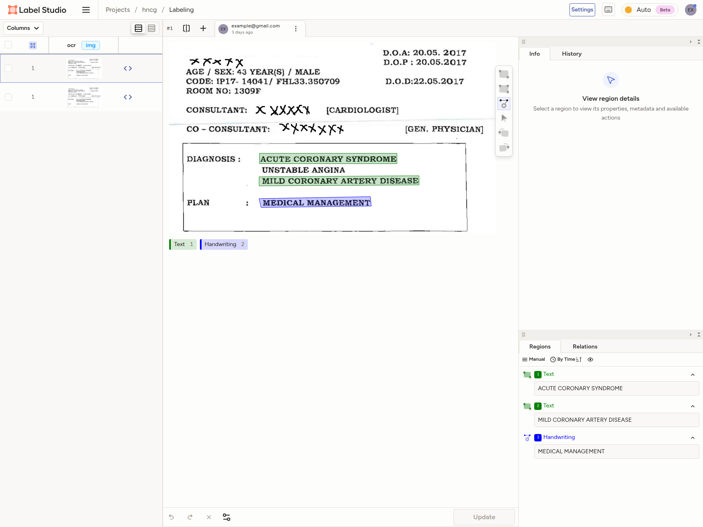
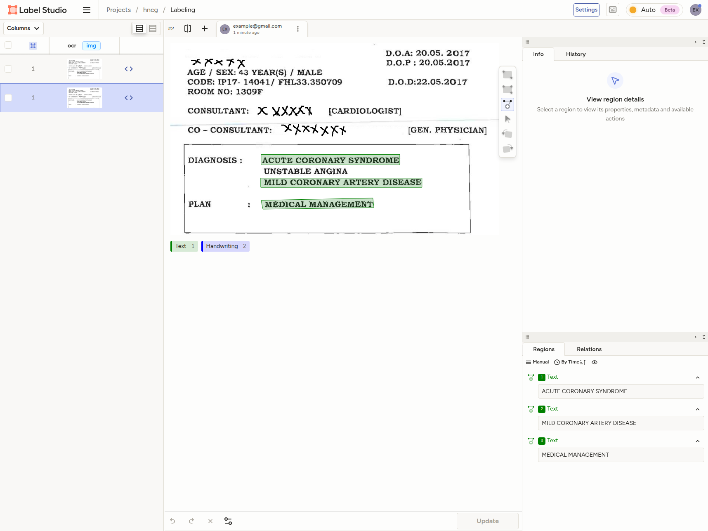

<div align="center">

  <h1>label-studio-converter</h1>

  <p>
    Convert between Label Studio OCR format and PPOCRLabelv2 format
  </p>

</div>

<br />

<!-- Table of Contents -->

# :notebook_with_decorative_cover: Table of Contents

- [Getting Started](#toolbox-getting-started)
  - [Prerequisites](#bangbang-prerequisites)
  - [Installation](#package-installation)
  - [Run Locally](#running-run-locally)
- [Usage](#eyes-usage)
  - [Library Usage](#library-usage)
  - [CLI Usage](#cli-usage)
    - [Examples](#examples)
  - [Enhancement Features](#enhancement-features)
  - [Using generated files with Label Studio](#using-generated-files-with-label-studio)
    - [Interface setup](#interface-setup)
    - [Serving annotation files locally](#serving-annotation-files-locally)
  - [Using generated files with PPOCRLabelv2](#using-generated-files-with-ppocrlabelv2)
  - [Conversion Margin of Error](#conversion-margin-of-error)
  - [Delete Generated Files](#delete-generated-files)
- [Roadmap](#compass-roadmap)
- [Contributing](#wave-contributing)
  - [Code of Conduct](#scroll-code-of-conduct)
- [License](#warning-license)
- [Contact](#handshake-contact)
- [Acknowledgements](#gem-acknowledgements)

<!-- Getting Started -->

## :toolbox: Getting Started

<!-- Prerequisites -->

### :bangbang: Prerequisites

- This project uses [pnpm](https://pnpm.io/) as package manager:

  ```bash
  npm install --global pnpm
  ```

- [Label Studio](https://labelstud.io/): Tested with version `1.22.0` and above.

- PPOCRLabelv2 from
  [`PFCCLab/PPOCRLabel`](https://github.com/PFCCLab/PPOCRLabel): Tested with
  latest commit
  [04928bf](https://github.com/PFCCLab/PPOCRLabel/tree/04928bf015656e41ba5569877df9b0666ca90f89)

- [Node.js](https://nodejs.org/): Tested with version `22.x` and above.

<!-- Installation -->

### :package: Installation

**As a CLI tool:**

```bash
npm install -g label-studio-converter
```

**As a library:**

```bash
npm install label-studio-converter
# or
pnpm add label-studio-converter
# or
yarn add label-studio-converter
```

<!-- Run Locally -->

### :running: Run Locally

Clone the project:

```bash
git clone https://github.com/DuckyMomo20012/label-studio-converter.git
```

Go to the project directory:

```bash
cd label-studio-converter
```

Install dependencies:

```bash
pnpm install
```

<!-- Usage -->

## :eyes: Usage

> [!IMPORTANT]
> This tool only supports conversion between PPOCRLabelv2 format and Label
> Studio ["OCR"
> template](https://labelstud.io/templates/optical_character_recognition). For
> setting up Label Studio for OCR tasks, please refer to the [Using generated
> files with Label Studio](#using-generated-files-with-label-studio) section.

> [!NOTE]
> **This package can be used both as a CLI tool and as a library.**
>
> - **CLI**: Run commands directly from the terminal
> - **Library**: Import and use functions in your TypeScript/JavaScript code

### Library Usage

**Conversion Functions:**

```ts
import {
  labelStudioToPPOCR,
  minLabelStudioToPPOCR,
  ppocrToLabelStudio
} from 'label-studio-converter';

// Convert Label Studio Full Format to PPOCRLabel
const fullData = [...]; // FullOCRLabelStudio type
const ppocrMap = await labelStudioToPPOCR(fullData, {
  baseImageDir: 'images/ch',
  normalizeShape: 'rectangle',
  widthIncrement: 5,
  heightIncrement: 5,
  precision: 0 // integers
});

// Convert Label Studio Min Format to PPOCRLabel
const minData = [...]; // MinOCRLabelStudio type
const ppocrMap2 = await minLabelStudioToPPOCR(minData, {
  baseImageDir: 'images/ch',
  precision: 0
});

// Convert PPOCRLabel to Label Studio
const ppocrData = [...]; // PPOCRLabel type
const labelStudioData = await ppocrToLabelStudio(ppocrData, {
  imagePath: 'example.jpg',
  baseServerUrl: 'http://localhost:8081',
  inputDir: './images',
  toFullJson: true,
  labelName: 'Text',
  precision: -1 // full precision
});
```

**Enhancement Functions:**

```ts
import {
  enhancePPOCRLabel,
  enhanceLabelStudioData,
} from 'label-studio-converter';

// Enhance PPOCRLabel data
const enhanced = enhancePPOCRLabel(ppocrData, {
  sortVertical: 'top-bottom',
  sortHorizontal: 'ltr',
  normalizeShape: 'rectangle',
  widthIncrement: 10,
  heightIncrement: 5,
  precision: 0,
});

// Enhance Label Studio data (Full or Min format)
const enhancedLS = await enhanceLabelStudioData(
  labelStudioData,
  true, // isFull: true for Full format, false for Min format
  {
    sortVertical: 'top-bottom',
    normalizeShape: 'rectangle',
    precision: 2,
  },
);
```

**Utility Functions:**

```ts
import {
  transformPoints,
  normalizeShape,
  resizeBoundingBox,
  sortBoundingBoxes,
} from 'label-studio-converter';

// Transform points (normalize + resize)
const transformed = transformPoints(points, {
  normalizeShape: 'rectangle',
  widthIncrement: 10,
  heightIncrement: 5,
});

// Normalize diamond shapes to rectangles
const normalized = normalizeShape(points);

// Resize bounding box
const resized = resizeBoundingBox(points, 10, 5);

// Sort bounding boxes
const sorted = sortBoundingBoxes(annotations, 'top-bottom', 'ltr');
```

### CLI Usage

**Available Commands:**

```bash
label-studio-converter --help
```

```bash
USAGE
  label-studio-converter toLabelStudio [--outDir value] [--fileName value] [--backup] [--defaultLabelName value] [--toFullJson] [--createFilePerImage] [--createFileListForServing] [--fileListName value] [--baseServerUrl value] [--sortVertical value] [--sortHorizontal value] [--normalizeShape value] [--widthIncrement value] [--heightIncrement value] [--precision value] [--recursive] [--filePattern value] [--outputMode value] <args>...
  label-studio-converter toPPOCR [--outDir value] [--fileName value] [--backup] [--baseImageDir value] [--sortVertical value] [--sortHorizontal value] [--normalizeShape value] [--widthIncrement value] [--heightIncrement value] [--precision value] [--recursive] [--filePattern value] <args>...
  label-studio-converter enhance-labelstudio [--outDir value] [--fileName value] [--backup] [--sortVertical value] [--sortHorizontal value] [--normalizeShape value] [--widthIncrement value] [--heightIncrement value] [--precision value] [--recursive] [--filePattern value] [--outputMode value] <args>...
  label-studio-converter enhance-ppocr [--outDir value] [--fileName value] [--backup] [--sortVertical value] [--sortHorizontal value] [--normalizeShape value] [--widthIncrement value] [--heightIncrement value] [--precision value] [--recursive] [--filePattern value] <args>...
  label-studio-converter --help
  label-studio-converter --version

Convert between Label Studio OCR format and PPOCRLabelv2 format

FLAGS
  -h --help     Print help information and exit
  -v --version  Print version information and exit

COMMANDS
  toLabelStudio        Convert PPOCRLabel files to Label Studio format
  toPPOCR              Convert Label Studio files to PPOCRLabel format
  enhance-labelstudio  Enhance Label Studio files with sorting, normalization, and resizing
  enhance-ppocr        Enhance PPOCRLabel files with sorting, normalization, and resizing
```

**Commands:**

- `toLabelStudio` - Convert PPOCRLabel files to Label Studio format

```bash
USAGE
  label-studio-converter toLabelStudio [--outDir value] [--fileName value] [--backup] [--defaultLabelName value] [--toFullJson] [--createFilePerImage] [--createFileListForServing] [--fileListName value] [--baseServerUrl value] [--sortVertical value] [--sortHorizontal value] [--normalizeShape value] [--widthIncrement value] [--heightIncrement value] [--precision value] [--recursive] [--filePattern value] [--outputMode value] <args>...
  label-studio-converter toLabelStudio --help

Convert PPOCRLabel files to Label Studio format

FLAGS
     [--outDir]                                                 Output directory. If not specified, files are saved in the same directory as the source files
     [--fileName]                                               Custom output filename (without extension). If not specified, uses source filename with format suffix
     [--backup/--noBackup]                                      Create backup of existing files before overwriting. Default: false
     [--defaultLabelName]                                       Default label name for text annotations. Default: "Text"
     [--toFullJson/--noToFullJson]                              Convert to Full OCR Label Studio format. Default: "true"
     [--createFilePerImage/--noCreateFilePerImage]              Create a separate Label Studio JSON file for each image. Default: "false"
     [--createFileListForServing/--noCreateFileListForServing]  Create a file list for serving in Label Studio. Default: "true"
     [--fileListName]                                           Name of the file list for serving. Default: "files.txt"
     [--baseServerUrl]                                          Base server URL for constructing image URLs in the file list. Default: "http://localhost:8081"
     [--sortVertical]                                           Sort bounding boxes vertically. Options: "none", "top-bottom", "bottom-top". Default: "none"
     [--sortHorizontal]                                         Sort bounding boxes horizontally. Options: "none", "ltr", "rtl". Default: "none"
     [--normalizeShape]                                         Normalize diamond-like shapes to axis-aligned rectangles. Options: "none", "rectangle". Default: "none"
     [--widthIncrement]                                         Increase bounding box width by this amount (in pixels). Can be negative to decrease. Default: 0
     [--heightIncrement]                                        Increase bounding box height by this amount (in pixels). Can be negative to decrease. Default: 0
     [--precision]                                              Number of decimal places for coordinates. Use -1 for full precision (no rounding). Default: -1
     [--recursive/--noRecursive]                                Recursively search directories for files. Default: false
     [--filePattern]                                            Regex pattern to match PPOCRLabel files (should match .txt files). Default: ".*\.txt$"
     [--outputMode]                                             Output mode: "annotations" for editable annotations (ground truth) or "predictions" for read-only predictions (pre-annotations). Default: "annotations"
  -h  --help                                                    Print help information and exit

ARGUMENTS
  args...  Input directories containing PPOCRLabel files
```

- `toPPOCR` - Convert Label Studio files to PPOCRLabel format

```bash
USAGE
  label-studio-converter toPPOCR [--outDir value] [--fileName value] [--backup] [--baseImageDir value] [--sortVertical value] [--sortHorizontal value] [--normalizeShape value] [--widthIncrement value] [--heightIncrement value] [--precision value] [--recursive] [--filePattern value] <args>...
  label-studio-converter toPPOCR --help

Convert Label Studio files to PPOCRLabel format

FLAGS
     [--outDir]                   Output directory. If not specified, files are saved in the same directory as the source files
     [--fileName]                 Output PPOCR file name. Default: "Label.txt"
     [--backup/--noBackup]        Create backup of existing files before overwriting. Default: false
     [--baseImageDir]             Base directory path to prepend to image filenames in output (e.g., "ch" or "images/ch")
     [--sortVertical]             Sort bounding boxes vertically. Options: "none", "top-bottom", "bottom-top". Default: "none"
     [--sortHorizontal]           Sort bounding boxes horizontally. Options: "none", "ltr", "rtl". Default: "none"
     [--normalizeShape]           Normalize diamond-like shapes to axis-aligned rectangles. Options: "none", "rectangle". Default: "none"
     [--widthIncrement]           Increase bounding box width by this amount (in pixels). Can be negative to decrease. Default: 0
     [--heightIncrement]          Increase bounding box height by this amount (in pixels). Can be negative to decrease. Default: 0
     [--precision]                Number of decimal places for coordinates. Use -1 for full precision (no rounding). Default: 0 (integers)
     [--recursive/--noRecursive]  Recursively search directories for files. Default: false
     [--filePattern]              Regex pattern to match Label Studio files (should match .json files). Default: ".*\.json$"
  -h  --help                      Print help information and exit

ARGUMENTS
  args...  Input directories containing Label Studio files
```

- `enhance-labelstudio` - Enhance Label Studio files with sorting,
  normalization, and resizing

```bash
USAGE
  label-studio-converter enhance-labelstudio [--outDir value] [--fileName value] [--backup] [--sortVertical value] [--sortHorizontal value] [--normalizeShape value] [--widthIncrement value] [--heightIncrement value] [--precision value] [--recursive] [--filePattern value] [--outputMode value] <args>...
  label-studio-converter enhance-labelstudio --help

Enhance Label Studio files with sorting, normalization, and resizing

FLAGS
     [--outDir]                   Output directory. If not specified, files are saved in the same directory as the source files
     [--fileName]                 Custom output filename. If not specified, uses the same name as the source file
     [--backup/--noBackup]        Create backup of existing files before overwriting. Default: false
     [--sortVertical]             Sort bounding boxes vertically. Options: "none", "top-bottom", "bottom-top". Default: "none"
     [--sortHorizontal]           Sort bounding boxes horizontally. Options: "none", "ltr", "rtl". Default: "none"
     [--normalizeShape]           Normalize diamond-like shapes to axis-aligned rectangles. Options: "none", "rectangle". Default: "none"
     [--widthIncrement]           Increase bounding box width by this amount (in pixels). Can be negative to decrease. Default: 0
     [--heightIncrement]          Increase bounding box height by this amount (in pixels). Can be negative to decrease. Default: 0
     [--precision]                Number of decimal places for coordinates. Use -1 for full precision (no rounding). Default: -1
     [--recursive/--noRecursive]  Recursively search directories for files. Default: false
     [--filePattern]              Regex pattern to match Label Studio files (should match .json files). Default: ".*\.json$"
     [--outputMode]               Output mode: "annotations" for editable annotations (ground truth) or "predictions" for read-only predictions (pre-annotations). Default: "annotations"
  -h  --help                      Print help information and exit

ARGUMENTS
  args...  Input directories containing Label Studio JSON files
```

- `enhance-ppocr` - Enhance PPOCRLabel files with sorting, normalization, and resizing

```bash
USAGE
  label-studio-converter enhance-ppocr [--outDir value] [--fileName value] [--backup] [--sortVertical value] [--sortHorizontal value] [--normalizeShape value] [--widthIncrement value] [--heightIncrement value] [--precision value] [--recursive] [--filePattern value] <args>...
  label-studio-converter enhance-ppocr --help

Enhance PPOCRLabel files with sorting, normalization, and resizing

FLAGS
     [--outDir]                   Output directory. If not specified, files are saved in the same directory as the source files
     [--fileName]                 Custom output filename. If not specified, uses the same name as the source file
     [--backup/--noBackup]        Create backup of existing files before overwriting. Default: false
     [--sortVertical]             Sort bounding boxes vertically. Options: "none", "top-bottom", "bottom-top". Default: "none"
     [--sortHorizontal]           Sort bounding boxes horizontally. Options: "none", "ltr", "rtl". Default: "none"
     [--normalizeShape]           Normalize diamond-like shapes to axis-aligned rectangles. Options: "none", "rectangle". Default: "none"
     [--widthIncrement]           Increase bounding box width by this amount (in pixels). Can be negative to decrease. Default: 0
     [--heightIncrement]          Increase bounding box height by this amount (in pixels). Can be negative to decrease. Default: 0
     [--precision]                Number of decimal places for coordinates. Use -1 for full precision (no rounding). Default: 0 (integers)
     [--recursive/--noRecursive]  Recursively search directories for files. Default: false
     [--filePattern]              Regex pattern to match PPOCRLabel files (should match .txt files). Default: ".*\.txt$"
  -h  --help                      Print help information and exit

ARGUMENTS
  args...  Input directories containing PPOCRLabel files
```

**Error Handling:**

The `toLabelStudio` command handles missing or unreadable image files gracefully:

- If an image file referenced in PPOCRLabel cannot be found or read, a warning is logged
- Default dimensions of **1920×1080** are used as fallback
- Conversion continues for remaining images without interruption

This allows the conversion process to complete even when some image files are missing from the dataset.

#### Examples

**Basic Conversions:**

```bash
# Convert PPOCRLabel files to full Label Studio format
label-studio-converter toLabelStudio ./input-ppocr --outDir ./output-label-studio

# Convert Label Studio files to PPOCRLabel format
label-studio-converter toPPOCR ./input-label-studio --outDir ./output-ppocr

# Convert with custom output filename for PPOCR
label-studio-converter toPPOCR ./input-label-studio --outDir ./output-ppocr --fileName MyLabels.txt

# Convert with base image directory path
label-studio-converter toPPOCR ./input-label-studio --baseImageDir images/ch
```

> [!NOTE]
> By default, all PPOCRLabel positions are treated as **polygons** in Label Studio.

**toLabelStudio Options:**

```bash
# Create separate JSON file for each image
label-studio-converter toLabelStudio ./input-ppocr \
  --outDir ./output \
  --createFilePerImage

# Specify custom label name (default is "Text")
label-studio-converter toLabelStudio ./input-ppocr \
  --outDir ./output \
  --defaultLabelName Handwriting

# Convert to minimal format (without serving support)
label-studio-converter toLabelStudio ./input-ppocr \
  --outDir ./output \
  --noToFullJson

# Disable file list creation for serving
label-studio-converter toLabelStudio ./input-ppocr \
  --outDir ./output \
  --noCreateFileListForServing

# Custom file list name and server URL
label-studio-converter toLabelStudio ./input-ppocr \
  --outDir ./output \
  --fileListName my-images.txt \
  --baseServerUrl http://192.168.1.100:8080

# Convert to predictions format (pre-annotations) instead of annotations
# Predictions are read-only and useful for pre-annotated data
label-studio-converter toLabelStudio ./input-ppocr \
  --outDir ./output \
  --outputMode predictions

# Convert to annotations format (default, editable ground truth)
label-studio-converter toLabelStudio ./input-ppocr \
  --outDir ./output \
  --outputMode annotations
```

> [!IMPORTANT]
> **Output Mode Restrictions:**
>
> - The `--outputMode` flag is only available for:
>   - `toLabelStudio` command (when using `--toFullJson`)
>   - `enhance-labelstudio` command (for Full JSON format files only)
> - **Not available** for:
>   - `toPPOCR` command (PPOCR format doesn't distinguish annotations/predictions)
>   - `enhance-ppocr` command (PPOCR format doesn't distinguish annotations/predictions)
>   - Min JSON Label Studio format (doesn't support annotations/predictions)
>
> **Prediction Scores:**
>
> - When converting from PPOCRLabel to Label Studio with `--outputMode predictions`, the `dt_score` field from PPOCRLabel is automatically mapped to the prediction `score` field in Label Studio
> - This allows pre-annotation confidence scores to be preserved and displayed in Label Studio
> - Score values should be between 0.0 and 1.0 (confidence percentage)

**toPPOCR Options:**

```bash
# Basic conversion with output directory
label-studio-converter toPPOCR ./input-label-studio \
  --outDir ./output

# Custom output filename
label-studio-converter toPPOCR ./input-label-studio \
  --outDir ./output \
  --fileName CustomLabel.txt

# Add base image directory to paths
label-studio-converter toPPOCR ./input-label-studio \
  --outDir ./output \
  --baseImageDir dataset/images
```

**Recursive Search and Pattern Matching:**

```bash
# Recursively search all subdirectories for .txt files
label-studio-converter toLabelStudio ./data --recursive

# Search with custom pattern (only files starting with "Label")
label-studio-converter toLabelStudio ./data \
  --recursive \
  --filePattern "Label.*\.txt$"

# Convert only specific JSON files (e.g., final annotations)
label-studio-converter toPPOCR ./annotations \
  --recursive \
  --filePattern ".*_final\.json$"

# Enhance only specific files matching pattern
label-studio-converter enhance-ppocr ./dataset \
  --recursive \
  --filePattern "train_.*\.txt$"
```

> [!NOTE]
>
> - `--recursive`: Searches all subdirectories for matching files
> - `--filePattern`: Regex pattern to filter files (default: `.*\.txt$` for PPOCR, `.*\.json$` for Label Studio)
> - Patterns are flexible - use any regex, but ensure they match appropriate file types (.txt for PPOCR, .json for Label Studio)

### Enhancement Features

The tool provides powerful enhancement capabilities that can be used standalone or integrated with conversion:

**Enhance PPOCRLabel files:**

```bash
# Sort annotations from top to bottom, left to right
label-studio-converter enhance-ppocr ./data --sortVertical top-bottom --sortHorizontal ltr

# Normalize diamond shapes to rectangles and resize
label-studio-converter enhance-ppocr ./data --normalizeShape rectangle --widthIncrement 10 --heightIncrement 5

# Apply all enhancements
label-studio-converter enhance-ppocr ./data \
  --sortVertical top-bottom \
  --sortHorizontal ltr \
  --normalizeShape rectangle \
  --widthIncrement 5 \
  --heightIncrement 5 \
  --precision 0
```

**Enhance Label Studio files:**

```bash
# Sort and normalize Label Studio annotations
label-studio-converter enhance-labelstudio ./data \
  --sortVertical top-bottom \
  --normalizeShape rectangle \
  --precision 2

# Works with both Full and Min formats automatically
label-studio-converter enhance-labelstudio ./label-studio-files --outDir ./enhanced
```

**Enhancement Options:**

- `--sortVertical`: Sort bounding boxes vertically
  - `none` (default): No sorting
  - `top-bottom`: Sort from top to bottom
  - `bottom-top`: Sort from bottom to top
  - Example:
    ```bash
    # Sort annotations from top to bottom
    label-studio-converter enhance-ppocr ./data --sortVertical top-bottom
    ```

- `--sortHorizontal`: Sort bounding boxes horizontally
  - `none` (default): No sorting
  - `ltr`: Sort left to right (useful for English, most European languages)
  - `rtl`: Sort right to left (useful for Arabic, Hebrew)
  - Example:

    ```bash
    # Sort annotations left to right
    label-studio-converter enhance-ppocr ./data --sortHorizontal ltr

    # Sort annotations right to left
    label-studio-converter enhance-ppocr ./data --sortHorizontal rtl
    ```

- `--normalizeShape`: Normalize shapes
  - `none` (default): Keep original shape
  - `rectangle`: Convert diamond-like or rotated shapes to axis-aligned rectangles
  - Example:
    ```bash
    # Convert irregular shapes to clean rectangles
    label-studio-converter enhance-ppocr ./data --normalizeShape rectangle
    ```

- `--widthIncrement`: Increase/decrease width (pixels, can be negative)
  - Default: `0`
  - Examples:

    ```bash
    # Increase width by 10 pixels
    label-studio-converter enhance-ppocr ./data --widthIncrement 10

    # Decrease width by 5 pixels
    label-studio-converter enhance-ppocr ./data --widthIncrement -5
    ```

- `--heightIncrement`: Increase/decrease height (pixels, can be negative)
  - Default: `0`
  - Examples:

    ```bash
    # Increase height by 15 pixels
    label-studio-converter enhance-ppocr ./data --heightIncrement 15

    # Decrease height by 3 pixels
    label-studio-converter enhance-ppocr ./data --heightIncrement -3
    ```

- `--precision`: Control the number of decimal places for coordinate values
  - `-1`: Full precision - no rounding, keeps all decimal places (default for Label Studio output)
    - Example output: `27.44656917885264`
  - `0`: Round to integers (default for PPOCR output)
    - Example output: `27`
  - `1`: Round to 1 decimal place
    - Example output: `27.4`
  - `2`: Round to 2 decimal places
    - Example output: `27.45`
  - Any positive integer for that many decimal places
  - Examples:

    ```bash
    # Use full precision
    label-studio-converter toLabelStudio ./data --precision -1

    # Use integer coordinates
    label-studio-converter toPPOCR ./data --precision 0

    # Use 2 decimal places
    label-studio-converter enhance-labelstudio ./data --precision 2
    ```

**Conversion with Enhancement:**

All enhancement options are available in conversion commands:

```bash
# Convert with enhancements applied during conversion
label-studio-converter toLabelStudio ./input-ppocr \
  --outDir ./output \
  --sortVertical top-bottom \
  --normalizeShape rectangle \
  --widthIncrement 10

label-studio-converter toPPOCR ./input-label-studio \
  --outDir ./output \
  --sortVertical top-bottom \
  --sortHorizontal ltr \
  --normalizeShape rectangle
```

**Convert PPOCRLabel files to Label Studio format with one file per image:**

```bash
label-studio-converter toLabelStudio ./input-ppocr --outDir ./output-label-studio --defaultLabelName Text --toFullJson --createFilePerImage --sortVertical none --sortHorizontal none
```

**Convert PPOCRLabel files to minimal Label Studio format (cannot be used for serving):**

```bash
label-studio-converter toLabelStudio ./input-ppocr --outDir ./output-label-studio --defaultLabelName Text --noToFullJson --sortVertical none --sortHorizontal none
```

> [!IMPORTANT]
> Minimal Label Studio format cannot be used for serving in Label Studio, as it
> lacks necessary fields such as `id` and `data`. So you can only use minimal
> format for conversion back to PPOCRLabelv2 format or other purposes.

**Shape Normalization**

Convert diamond-like or irregular quadrilateral shapes to axis-aligned
rectangles. This is useful when your annotations have irregular shapes that you
want to normalize to clean, horizontal/vertical bounding boxes:

```bash
# Convert to axis-aligned rectangles
label-studio-converter toLabelStudio ./input-ppocr --outDir ./output --normalizeShape rectangle

# For toPPOCR command
label-studio-converter toPPOCR ./input-label-studio --outDir ./output --normalizeShape rectangle
```

<details>
<summary>
  <b>Before normalization</b> (diamond-like shapes):
</summary>


</details>

<details>
<summary>
  <b>After normalization</b> (axis-aligned rectangles):
</summary>

Command:

```bash
./dist/cli.js toPPOCR ./tmp --baseImageDir output --normalizeShape rectangle
```


</details>

<details>
<summary>
  <b>Before normalization</b> (diamond-like vertical shapes):
</summary>


</details>

<details>
<summary>
  <b>After normalization</b> (axis-aligned vertical rectangles):
</summary>

Command:

```bash
./dist/cli.js toPPOCR ./tmp --baseImageDir output --normalizeShape rectangle
```


</details>

**Bounding Box Resizing**

Increase or decrease bounding box dimensions while keeping them centered. This
is useful for adjusting annotation margins:

```bash
# Increase width by 10 pixels and height by 20 pixels
label-studio-converter toLabelStudio ./input-ppocr --outDir ./output --widthIncrement 10 --heightIncrement 20

# Decrease width by 5 pixels (negative increment)
label-studio-converter toLabelStudio ./input-ppocr --outDir ./output --widthIncrement -5

# Works with toPPOCR as well
label-studio-converter toPPOCR ./input-label-studio --outDir ./output --widthIncrement 10 --heightIncrement 10
```

**Combining Features**

You can combine shape normalization and resizing:

```bash
# Normalize to rectangle and increase size
label-studio-converter toLabelStudio ./input-ppocr --outDir ./output --normalizeShape rectangle --widthIncrement 5 --heightIncrement 5

# Also works with sorting
label-studio-converter toLabelStudio ./input-ppocr --outDir ./output --normalizeShape rectangle --widthIncrement 10 --sortVertical top-bottom --sortHorizontal ltr
```

**Number Precision Control**

Control the precision of coordinate values in the output. This is useful for
matching format expectations or reducing file size:

```bash
# Convert to Label Studio with full precision (default: -1)
label-studio-converter toLabelStudio ./input-ppocr --outDir ./output --precision -1

# Convert to PPOCR with integer coordinates (default: 0)
label-studio-converter toPPOCR ./input-label-studio --outDir ./output --precision 0

# Use 2 decimal places for more compact but still precise coordinates
label-studio-converter toLabelStudio ./input-ppocr --outDir ./output --precision 2
```

Precision values:

- `-1`: Full floating-point precision (default for Label Studio output)
- `0`: Round to integers (default for PPOCR output)
- `1+`: Round to specified number of decimal places

> [!NOTE]
> The default precision matches typical format conventions: Label Studio uses
> full precision for percentage-based coordinates, while PPOCR format typically
> uses integer pixel coordinates.

### Using generated files with Label Studio

#### Interface setup

When creating a new labeling project in Label Studio, choose the ["OCR"
template](https://labelstud.io/templates/optical_character_recognition).
This will set up the appropriate interface for text recognition tasks.

This project uses the following Label Studio interface configuration:

```xml
<View>
	<Image name="image" value="$ocr" zoom="false" rotateControl="true" zoomControl="false"/>
	<Labels name="label" toName="image">
		<Label value="Text" background="green"/>
		<Label value="Handwriting" background="blue"/>
	</Labels>
	<Rectangle name="bbox" toName="image" strokeWidth="3"/>
	<Polygon name="poly" toName="image" strokeWidth="3"/>
	<TextArea name="transcription" toName="image" editable="true" perRegion="true" required="false" maxSubmissions="1" rows="5" placeholder="Recognized Text" displayMode="region-list"/>
</View>
```

This setup includes:

- An `Image` tag to display the image to be annotated.
- A `Labels` tag with two label options: `Text` and `Handwriting`. By default,
  all annotations will be labeled as `Text`. You can modify this based on your
  needs.
- A `Rectangle` tag to allow annotators to draw bounding boxes around text regions.
- A `Polygon` tag to allow annotators to draw polygons around text regions.
- A `TextArea` tag for annotators to input the recognized text for each region.

> [!IMPORTANT]
> Make sure that the `Image` tag's `value` attribute is set to `$ocr`, as this
> is where the image URLs will be populated from the generated JSON files.

#### Serving annotation files locally

To serve the generated Label Studio annotation files and images locally, you can
follow official [Label Studio
documentation](https://labelstud.io/guide/tasks#Import-data-from-a-local-directory).

1. Start a simple HTTP server in the output directory containing the generated
   Label Studio files. You can use Python's built-in HTTP server for this:

   ```bash
   cd ./output-label-studio
   python3 -m http.server 8081
   ```

   or using `http-server` from npm:

   ```bash
   npx http-server -p 8081 --cors
   ```

> [!IMPORTANT]
> Ensure that the port number (e.g., `8081`) matches the `baseServerUrl` used
> during conversion.

> [!NOTE]
> The server may have to be configured CORS settings to allow Label Studio to
> access the files. Refer to the documentation of the server you are using for
> instructions on how to enable CORS.

2. Add the file directory as source storage in Label Studio, by following the official
   [Label Studio
   documentation](https://labelstud.io/guide/tasks#Import-data-from-a-local-directory).

   By default, the generated file list is named `files.txt`. before running the
   command below, ensure that the `files.txt` is copied to the `./myfiles`
   directory.

   The following command starts a Docker container with the latest image of
   Label Studio with port 8080 and an environment variable that allows Label
   Studio to access local files. In this example, a local directory `./myfiles`
   is mounted to the `/label-studio/files` location.

   ```bash
   docker run -it -p 8080:8080 -v $(pwd)/mydata:/label-studio/data \
     --env LABEL_STUDIO_LOCAL_FILES_SERVING_ENABLED=true \
     --env LABEL_STUDIO_LOCAL_FILES_DOCUMENT_ROOT=/label-studio/files \
     -v $(pwd)/myfiles:/label-studio/files \
     heartexlabs/label-studio:latest label-studio
   ```

3. Open your web browser and navigate to `http://localhost:8080` to access
   Label Studio.

4. Create a new project or open an existing one, and go to the "Import" tab.

5. Import the generated tasks to Label Studio.

### Using generated files with PPOCRLabelv2

PPOCRLabelv2 has many Github repositories, but we have tested the generated
files with the following repository:

- [`PFCCLab/PPOCRLabel`](https://github.com/PFCCLab/PPOCRLabel).

Generated files can be used by placing them in the appropriate directory
structure as expected by PPOCRLabelv2, by replaceing the existing `Label.txt`
files in the dataset directories.

If the images are put in a different directory, make sure to update the image
directory path by specifying the `baseImageDir` option during conversion.

### Conversion Margin of Error

During conversion between two formats, which are PPOCRLabelv2 and Label Studio,
margin of errors may occur due to differences in how each format handles certain
aspects of the data.

**Convert from Label Studio to PPOCRLabelv2**

Label Studio annotation:



Generated PPOCRLabelv2 annotation:


Converted back to Label Studio annotation:



<details>
<summary>
  <b>Original data</b>:
</summary>

```json
[
  {
    "id": 1,
    "annotations": [
      {
        "id": 201,
        "completed_by": 1,
        "result": [
          {
            "original_width": 889,
            "original_height": 520,
            "image_rotation": 0,
            "value": {
              "x": 27.691012033297714,
              "y": 58.08133472367049,
              "width": 42.14645223570203,
              "height": 5.4223149113660085,
              "rotation": 0
            },
            "id": "pa6F68vZpa",
            "from_name": "bbox",
            "to_name": "image",
            "type": "rectangle",
            "origin": "manual"
          },
          {
            "original_width": 889,
            "original_height": 520,
            "image_rotation": 0,
            "value": {
              "x": 27.691012033297714,
              "y": 58.08133472367049,
              "width": 42.14645223570203,
              "height": 5.4223149113660085,
              "rotation": 0,
              "labels": ["Text"]
            },
            "id": "pa6F68vZpa",
            "from_name": "label",
            "to_name": "image",
            "type": "labels",
            "origin": "manual"
          },
          {
            "original_width": 889,
            "original_height": 520,
            "image_rotation": 0,
            "value": {
              "x": 27.691012033297714,
              "y": 58.08133472367049,
              "width": 42.14645223570203,
              "height": 5.4223149113660085,
              "rotation": 0,
              "text": ["ACUTE CORONARY SYNDROME"]
            },
            "id": "pa6F68vZpa",
            "from_name": "transcription",
            "to_name": "image",
            "type": "textarea",
            "origin": "manual"
          },
          {
            "original_width": 889,
            "original_height": 520,
            "image_rotation": 0,
            "value": {
              "x": 27.569025196146622,
              "y": 70.38581856100105,
              "width": 49.03965680633165,
              "height": 4.788140385599174,
              "rotation": 359.64368755661553
            },
            "id": "iIfXbvxhFx",
            "from_name": "bbox",
            "to_name": "image",
            "type": "rectangle",
            "origin": "manual"
          },
          {
            "original_width": 889,
            "original_height": 520,
            "image_rotation": 0,
            "value": {
              "x": 27.569025196146622,
              "y": 70.38581856100105,
              "width": 49.03965680633165,
              "height": 4.788140385599174,
              "rotation": 359.64368755661553,
              "labels": ["Text"]
            },
            "id": "iIfXbvxhFx",
            "from_name": "label",
            "to_name": "image",
            "type": "labels",
            "origin": "manual"
          },
          {
            "original_width": 889,
            "original_height": 520,
            "image_rotation": 0,
            "value": {
              "x": 27.569025196146622,
              "y": 70.38581856100105,
              "width": 49.03965680633165,
              "height": 4.788140385599174,
              "rotation": 359.64368755661553,
              "text": ["MILD CORONARY ARTERY DISEASE"]
            },
            "id": "iIfXbvxhFx",
            "from_name": "transcription",
            "to_name": "image",
            "type": "textarea",
            "origin": "manual"
          },
          {
            "original_width": 889,
            "original_height": 520,
            "image_rotation": 0,
            "value": {
              "points": [
                [27.630018614722168, 81.85610010427528],
                [61.66434617987663, 80.8133472367049],
                [61.969313272754356, 85.71428571428571],
                [28.239952800477624, 86.44421272158499]
              ],
              "closed": true
            },
            "id": "mpqixNR8uh",
            "from_name": "poly",
            "to_name": "image",
            "type": "polygon",
            "origin": "manual"
          },
          {
            "original_width": 889,
            "original_height": 520,
            "image_rotation": 0,
            "value": {
              "points": [
                [27.630018614722168, 81.85610010427528],
                [61.66434617987663, 80.8133472367049],
                [61.969313272754356, 85.71428571428571],
                [28.239952800477624, 86.44421272158499]
              ],
              "closed": true,
              "labels": ["Handwriting"]
            },
            "id": "mpqixNR8uh",
            "from_name": "label",
            "to_name": "image",
            "type": "labels",
            "origin": "manual"
          },
          {
            "original_width": 889,
            "original_height": 520,
            "image_rotation": 0,
            "value": {
              "points": [
                [27.630018614722168, 81.85610010427528],
                [61.66434617987663, 80.8133472367049],
                [61.969313272754356, 85.71428571428571],
                [28.239952800477624, 86.44421272158499]
              ],
              "closed": true,
              "text": ["MEDICAL MANAGEMENT"]
            },
            "id": "mpqixNR8uh",
            "from_name": "transcription",
            "to_name": "image",
            "type": "textarea",
            "origin": "manual"
          }
        ],
        "was_cancelled": false,
        "ground_truth": false,
        "created_at": "2026-01-07T03:14:39.424067Z",
        "updated_at": "2026-01-10T03:21:09.833576Z",
        "draft_created_at": "2026-01-07T03:14:04.596361Z",
        "lead_time": 2686.9700000000003,
        "prediction": {},
        "result_count": 3,
        "unique_id": "7e8c79f1-49ce-471c-8b26-8b8c6f9c3401",
        "import_id": null,
        "last_action": null,
        "bulk_created": false,
        "task": 1,
        "project": 2,
        "updated_by": 1,
        "parent_prediction": null,
        "parent_annotation": null,
        "last_created_by": null
      }
    ],
    "file_upload": "5b1e3483-example.jpg",
    "drafts": [],
    "predictions": [],
    "data": { "ocr": "\/data\/upload\/2\/5b1e3483-example.jpg" },
    "meta": {},
    "created_at": "2026-01-07T03:13:41.175183Z",
    "updated_at": "2026-01-10T03:21:09.923449Z",
    "allow_skip": true,
    "inner_id": 1,
    "total_annotations": 1,
    "cancelled_annotations": 0,
    "total_predictions": 0,
    "comment_count": 0,
    "unresolved_comment_count": 0,
    "last_comment_updated_at": null,
    "project": 2,
    "updated_by": 1,
    "comment_authors": []
  }
]
```

</details>

<details>
<summary>
  <b>Converted data</b>:
</summary>

Command:

```bash
./dist/cli.js toPPOCR ./tmp --baseImageDir output
```

Output:

```
output/example.jpg	[{"transcription":"ACUTE CORONARY SYNDROME","points":[[246,302],[621,302],[621,330],[246,330]],"dt_score":1},{"transcription":"MILD CORONARY ARTERY DISEASE","points":[[245,366],[681,366],[681,391],[245,391]],"dt_score":1},{"transcription":"MEDICAL MANAGEMENT","points":[[246,426],[548,420],[551,446],[251,450]],"dt_score":1}]
```

</details>

<details>
<summary>
  <b>Convert back to Label Studio</b>:
</summary>

Command:

```bash
./dist/cli.js toLabelStudio ./tmp
```

Output:

```json
[
  [
    {
      "id": 1,
      "annotations": [
        {
          "id": 1,
          "completed_by": 1,
          "result": [
            {
              "original_width": 889,
              "original_height": 520,
              "image_rotation": 0,
              "value": {
                "points": [
                  [27.671541057367826, 58.07692307692308],
                  [69.85376827896513, 58.07692307692308],
                  [69.85376827896513, 63.46153846153846],
                  [27.671541057367826, 63.46153846153846]
                ],
                "closed": true
              },
              "id": "fce62949-7",
              "from_name": "poly",
              "to_name": "image",
              "type": "polygon",
              "origin": "manual"
            },
            {
              "original_width": 889,
              "original_height": 520,
              "image_rotation": 0,
              "value": {
                "points": [
                  [27.671541057367826, 58.07692307692308],
                  [69.85376827896513, 58.07692307692308],
                  [69.85376827896513, 63.46153846153846],
                  [27.671541057367826, 63.46153846153846]
                ],
                "closed": true,
                "labels": ["Text"]
              },
              "id": "fce62949-7",
              "from_name": "label",
              "to_name": "image",
              "type": "labels",
              "origin": "manual"
            },
            {
              "original_width": 889,
              "original_height": 520,
              "image_rotation": 0,
              "value": {
                "points": [
                  [27.671541057367826, 58.07692307692308],
                  [69.85376827896513, 58.07692307692308],
                  [69.85376827896513, 63.46153846153846],
                  [27.671541057367826, 63.46153846153846]
                ],
                "closed": true,
                "text": ["ACUTE CORONARY SYNDROME"]
              },
              "id": "fce62949-7",
              "from_name": "transcription",
              "to_name": "image",
              "type": "textarea",
              "origin": "manual"
            },
            {
              "original_width": 889,
              "original_height": 520,
              "image_rotation": 0,
              "value": {
                "points": [
                  [27.559055118110237, 70.38461538461539],
                  [76.6029246344207, 70.38461538461539],
                  [76.6029246344207, 75.1923076923077],
                  [27.559055118110237, 75.1923076923077]
                ],
                "closed": true
              },
              "id": "9d9389a6-f",
              "from_name": "poly",
              "to_name": "image",
              "type": "polygon",
              "origin": "manual"
            },
            {
              "original_width": 889,
              "original_height": 520,
              "image_rotation": 0,
              "value": {
                "points": [
                  [27.559055118110237, 70.38461538461539],
                  [76.6029246344207, 70.38461538461539],
                  [76.6029246344207, 75.1923076923077],
                  [27.559055118110237, 75.1923076923077]
                ],
                "closed": true,
                "labels": ["Text"]
              },
              "id": "9d9389a6-f",
              "from_name": "label",
              "to_name": "image",
              "type": "labels",
              "origin": "manual"
            },
            {
              "original_width": 889,
              "original_height": 520,
              "image_rotation": 0,
              "value": {
                "points": [
                  [27.559055118110237, 70.38461538461539],
                  [76.6029246344207, 70.38461538461539],
                  [76.6029246344207, 75.1923076923077],
                  [27.559055118110237, 75.1923076923077]
                ],
                "closed": true,
                "text": ["MILD CORONARY ARTERY DISEASE"]
              },
              "id": "9d9389a6-f",
              "from_name": "transcription",
              "to_name": "image",
              "type": "textarea",
              "origin": "manual"
            },
            {
              "original_width": 889,
              "original_height": 520,
              "image_rotation": 0,
              "value": {
                "points": [
                  [27.671541057367826, 81.92307692307692],
                  [61.64229471316085, 80.76923076923077],
                  [61.97975253093363, 85.76923076923076],
                  [28.23397075365579, 86.53846153846155]
                ],
                "closed": true
              },
              "id": "4f2e63fc-b",
              "from_name": "poly",
              "to_name": "image",
              "type": "polygon",
              "origin": "manual"
            },
            {
              "original_width": 889,
              "original_height": 520,
              "image_rotation": 0,
              "value": {
                "points": [
                  [27.671541057367826, 81.92307692307692],
                  [61.64229471316085, 80.76923076923077],
                  [61.97975253093363, 85.76923076923076],
                  [28.23397075365579, 86.53846153846155]
                ],
                "closed": true,
                "labels": ["Text"]
              },
              "id": "4f2e63fc-b",
              "from_name": "label",
              "to_name": "image",
              "type": "labels",
              "origin": "manual"
            },
            {
              "original_width": 889,
              "original_height": 520,
              "image_rotation": 0,
              "value": {
                "points": [
                  [27.671541057367826, 81.92307692307692],
                  [61.64229471316085, 80.76923076923077],
                  [61.97975253093363, 85.76923076923076],
                  [28.23397075365579, 86.53846153846155]
                ],
                "closed": true,
                "text": ["MEDICAL MANAGEMENT"]
              },
              "id": "4f2e63fc-b",
              "from_name": "transcription",
              "to_name": "image",
              "type": "textarea",
              "origin": "manual"
            }
          ],
          "was_cancelled": false,
          "ground_truth": false,
          "created_at": "2026-01-10T03:25:05.530Z",
          "updated_at": "2026-01-10T03:25:05.530Z",
          "draft_created_at": "2026-01-10T03:25:05.530Z",
          "lead_time": 0,
          "prediction": {},
          "result_count": 9,
          "unique_id": "e17b1920-022b-4e48-9207-f9904a42e840",
          "import_id": null,
          "last_action": null,
          "bulk_created": false,
          "task": 1,
          "project": 1,
          "updated_by": 1,
          "parent_prediction": null,
          "parent_annotation": null,
          "last_created_by": null
        }
      ],
      "file_upload": "5b1e3483-example.jpg",
      "drafts": [],
      "predictions": [],
      "data": {
        "ocr": "http://localhost:8081/output/5b1e3483-example.jpg"
      },
      "meta": {},
      "created_at": "2026-01-10T03:25:05.530Z",
      "updated_at": "2026-01-10T03:25:05.530Z",
      "allow_skip": false,
      "inner_id": 1,
      "total_annotations": 1,
      "cancelled_annotations": 0,
      "total_predictions": 0,
      "comment_count": 0,
      "unresolved_comment_count": 0,
      "last_comment_updated_at": null,
      "project": 1,
      "updated_by": 1,
      "comment_authors": []
    }
  ]
]
```

</details>

**Comparison of bounding box positions:**

|     Original Label Studio (polygon)      | Label Studio to PPOCRLabel | PPOCRLabel -> Label Studio (polygon)     | Margin (Converted Back − Original)      |
| :--------------------------------------: | -------------------------- | ---------------------------------------- | --------------------------------------- |
| \[27.630018614722168, 81.85610010427528] | \[246,426]                 | \[27.671541057367826, 81.92307692307692] | \[0.04152244264566, 0.06697681880164]   |
|  \[61.66434617987663, 80.8133472367049]  | \[548,420]                 | \[61.64229471316085, 80.76923076923077]  | \[-0.02205146671578, -0.04411646747413] |
| \[61.969313272754356, 85.71428571428571] | \[551,446]                 | \[61.97975253093363, 85.76923076923076]  | \[0.01043925817927, 0.05494505494505]   |
| \[28.239952800477624, 86.44421272158499] | \[251,450]                 | \[28.23397075365579, 86.53846153846155]  | \[-0.00598204682183, 0.09424881687656]  |

> [!IMPORTANT]
> So as you can see, after converting from Label Studio to PPOCRLabelv2 and then
> back to Label Studio, the positions of the bounding boxes have slight
> differences due to the conversion process. This may affect the accuracy of the
> annotations, especially if precise bounding box locations are critical for your
> application.

### Delete generated files

To delete the generated files after conversion, you can use the following
commands:

**Linux/macOS**:

- When you specified a custom output directory using `--outDir` option:

  ```bash
  rm -rf ./output-label-studio
  ```

- When you did not specify an output directory (default: files are saved in the same directory as the source files):

  **For default output file names:**

  ```bash
  # Delete Label Studio files generated by toLabelStudio command
  find ./input-dir -type f \( -name "*_full.json" -o -name "*_min.json" \) -delete

  # Delete PPOCRLabel files generated by toPPOCR command
  find ./input-dir -type f -name "*_Label.txt" -delete

  # Delete file list for serving
  find ./input-dir -type f -name "files.txt" -delete
  ```

  **For custom output file names or patterns:**

  ```bash
  # Delete files with custom pattern (e.g., files ending with _converted.json)
  find ./input-dir -type f -name "*_converted.json" -delete

  # Delete files with custom PPOCRLabel filename (e.g., CustomLabel.txt)
  find ./input-dir -type f -name "*_CustomLabel.txt" -delete
  ```

**Windows (PowerShell)**:

- When you specified a custom output directory using `--outDir` option:

  ```powershell
  Remove-Item -Path ".\output-label-studio" -Recurse -Force
  ```

- When you did not specify an output directory (default: files are saved in the same directory as the source files):

  **For default output file names:**

  ```powershell
  # Delete Label Studio files generated by toLabelStudio command
  Get-ChildItem -Path ".\input-dir" -Recurse -Include "*_full.json","*_min.json" | Remove-Item -Force

  # Delete PPOCRLabel files generated by toPPOCR command
  Get-ChildItem -Path ".\input-dir" -Recurse -Filter "*_Label.txt" | Remove-Item -Force

  # Delete file list for serving
  Get-ChildItem -Path ".\input-dir" -Recurse -Filter "files.txt" | Remove-Item -Force
  ```

  **For custom output file names or patterns:**

  ```powershell
  # Delete files with custom pattern (e.g., files ending with _converted.json)
  Get-ChildItem -Path ".\input-dir" -Recurse -Filter "*_converted.json" | Remove-Item -Force

  # Delete files with custom PPOCRLabel filename (e.g., CustomLabel.txt)
  Get-ChildItem -Path ".\input-dir" -Recurse -Filter "*_CustomLabel.txt" | Remove-Item -Force
  ```

> [!WARNING]
> These commands will permanently delete files. Make sure to review the file
> patterns and paths before executing. You can preview files that would be
> deleted by removing the `-delete` flag (Linux/macOS) or `| Remove-Item-Force`
> (Windows) from the commands.

<!-- Roadmap -->

## :compass: Roadmap

- [x] Add tests.

<!-- Contributing -->

## :wave: Contributing

<a href="https://github.com/DuckyMomo20012/label-studio-converter/graphs/contributors">
  
</a>

Contributions are always welcome!

Please read the [contribution guidelines](./CONTRIBUTING.md).

<!-- Code of Conduct -->

### :scroll: Code of Conduct

Please read the [Code of Conduct](./CODE_OF_CONDUCT.md).

<!-- License -->

## :warning: License

This project is licensed under the **Creative Commons Attribution-NonCommercial-ShareAlike 4.0 International (CC BY-NC-SA 4.0)** License.

[](https://creativecommons.org/licenses/by-nc-sa/4.0/).

See the **[LICENSE.md](./LICENSE.md)** file for full details.

<!-- Contact -->

## :handshake: Contact

Duong Vinh - tienvinh.duong4@gmail.com

Project Link: [https://github.com/DuckyMomo20012/label-studio-converter](https://github.com/DuckyMomo20012/label-studio-converter).

<!-- Acknowledgments -->

## :gem: Acknowledgements

Here are useful resources and libraries that we have used in our projects:

- [Label Studio Documentation](https://labelstud.io/guide): Official documentation for Label Studio.
- [PPOCRLabel GitHub Repository](https://github.com/PFCCLab/PPOCRLabel):
  Repository for PPOCRLabelv2 tool.
