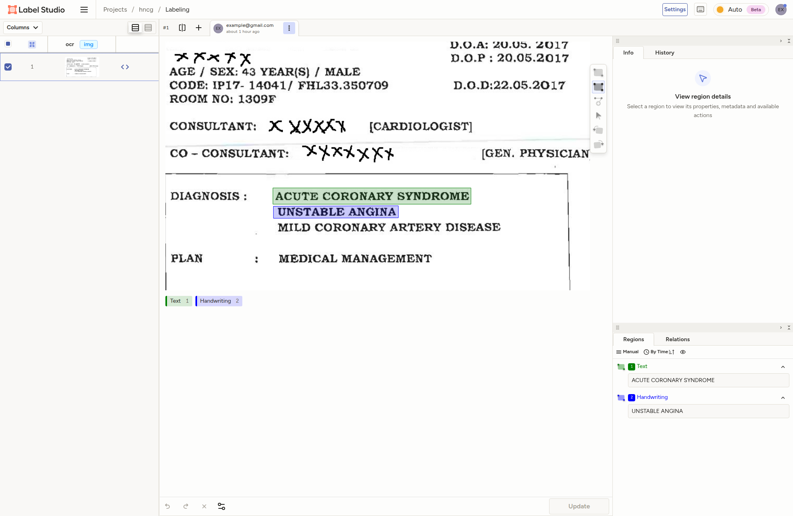
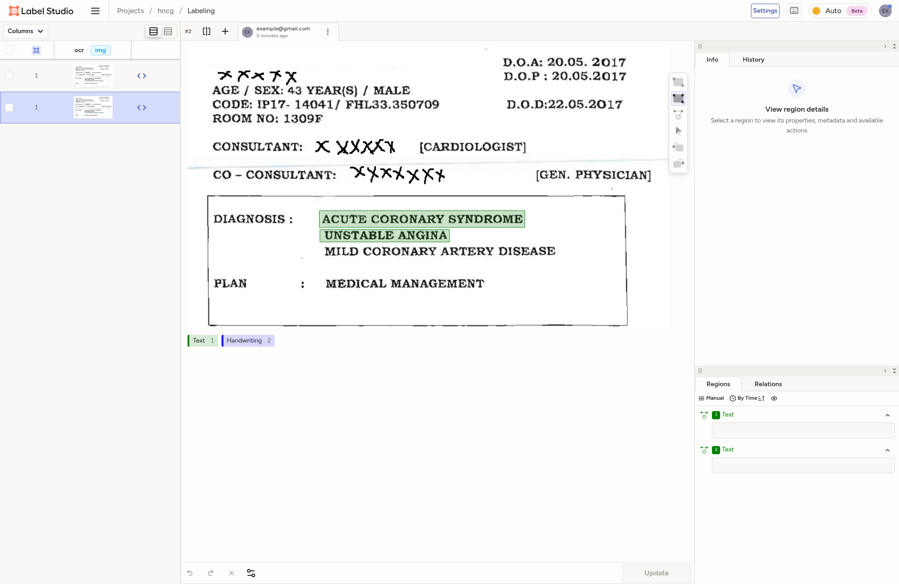

<div align="center">

  <h1>label-studio-converter</h1>

  <p>
    Convert between Label Studio OCR format and PPOCRLabelv2 format
  </p>

</div>

<br />

<!-- Table of Contents -->

# :notebook_with_decorative_cover: Table of Contents

- [Getting Started](#toolbox-getting-started)
  - [Prerequisites](#bangbang-prerequisites)
  - [Run Locally](#running-run-locally)
- [Usage](#eyes-usage)
  - [Basic Usage](#basic-usage)
  - [CLI Usage](#cli-usage)
  - [Using generated files with Label Studio](#using-generated-files-with-label-studio)
    - [Interface setup](#interface-setup)
    - [Serving annotation files locally](#serving-annotation-files-locally)
  - [Using generated files with PPOCRLabelv2](#using-generated-files-with-ppocrlabelv2)
  - [Conversion Margin of Error](#conversion-margin-of-error)
- [Roadmap](#compass-roadmap)
- [Contributing](#wave-contributing)
  - [Code of Conduct](#scroll-code-of-conduct)
- [License](#warning-license)
- [Contact](#handshake-contact)
- [Acknowledgements](#gem-acknowledgements)

<!-- Getting Started -->

## :toolbox: Getting Started

<!-- Prerequisites -->

### :bangbang: Prerequisites

This project uses [pnpm](https://pnpm.io/) as package manager:

```bash
npm install --global pnpm
```

<!-- Run Locally -->

### :running: Run Locally

Clone the project:

```bash
git clone https://github.com/DuckyMomo20012/label-studio-converter.git
```

Go to the project directory:

```bash
cd label-studio-converter
```

Install dependencies:

```bash
pnpm install
```

<!-- Usage -->

## :eyes: Usage

### Basic Usage

```ts
import { toLabelStudio, toPPOCR } from 'label-studio-converter';

// Convert PPOCRLabel files to Label Studio format
await toLabelStudio({
  inputDirs: ['./input-ppocr'],
  outDir: './output-label-studio',
  defaultLabelName: 'Text',
  toFullJson: true,
  createFilePerImage: false,
  createFileListForServing: true,
  fileListName: 'files.txt',
  baseServerUrl: 'http://localhost:8081',
  sortVertical: 'none',
  sortHorizontal: 'none',
});

// Convert Label Studio files to PPOCRLabel format
await toPPOCR({
  inputDirs: ['./input-label-studio'],
  outDir: './output-ppocr',
  fileName: 'Label.txt',
  baseImageDir: 'images/ch',
  sortVertical: 'none',
  sortHorizontal: 'none',
});
```

### CLI Usage

```
USAGE
  label-studio-converter toLabelStudio [--outDir value] [--defaultLabelName value] [--toFullJson] [--createFilePerImage] [--createFileListForServing] [--fileListName value] [--baseServerUrl value] [--sortVertical value] [--sortHorizontal value] <args>...
  label-studio-converter toPPOCR [--outDir value] [--fileName value] [--baseImageDir value] [--sortVertical value] [--sortHorizontal value] <args>...
  label-studio-converter --help
  label-studio-converter --version

Convert between Label Studio OCR format and PPOCRLabelv2 format

FLAGS
  -h --help     Print help information and exit
  -v --version  Print version information and exit

COMMANDS
  toLabelStudio  Convert PPOCRLabel files to Label Studio format
  toPPOCR        Convert Label Studio files to PPOCRLabel format
```

Subcommands:

```
USAGE
  label-studio-converter toLabelStudio [--outDir value] [--defaultLabelName value] [--toFullJson] [--createFilePerImage] [--createFileListForServing] [--fileListName value] [--baseServerUrl value] [--sortVertical value] [--sortHorizontal value] <args>...
  label-studio-converter toLabelStudio --help

Convert PPOCRLabel files to Label Studio format

FLAGS
     [--outDir]                                                 Output directory. Default to "./output"
     [--defaultLabelName]                                       Default label name for text annotations. Default to "Text"
     [--toFullJson/--noToFullJson]                              Convert to Full OCR Label Studio format. Default to "true"
     [--createFilePerImage/--noCreateFilePerImage]              Create a separate Label Studio JSON file for each image. Default to "false"
     [--createFileListForServing/--noCreateFileListForServing]  Create a file list for serving in Label Studio. Default to "true"
     [--fileListName]                                           Name of the file list for serving. Default to "files.txt"
     [--baseServerUrl]                                          Base server URL for constructing image URLs in the file list. Default to "http://localhost:8081"
     [--sortVertical]                                           Sort bounding boxes vertically. Options: "none" (default), "top-bottom", "bottom-top"
     [--sortHorizontal]                                         Sort bounding boxes horizontally. Options: "none" (default), "ltr", "rtl"
  -h  --help                                                    Print help information and exit

ARGUMENTS
  args...  Input directories containing PPOCRLabel files
```

```
USAGE
  label-studio-converter toPPOCR [--outDir value] [--fileName value] [--baseImageDir value] [--sortVertical value] [--sortHorizontal value] <args>...
  label-studio-converter toPPOCR --help

Convert Label Studio files to PPOCRLabel format

FLAGS
     [--outDir]          Output directory. Default to "./output"
     [--fileName]        Output PPOCR file name. Default to "Label.txt"
     [--baseImageDir]    Base directory path to prepend to image filenames in output (e.g., "ch" or "images/ch")
     [--sortVertical]    Sort bounding boxes vertically. Options: "none" (default), "top-bottom", "bottom-top"
     [--sortHorizontal]  Sort bounding boxes horizontally. Options: "none" (default), "ltr", "rtl"
  -h  --help             Print help information and exit

ARGUMENTS
  args...  Input directories containing Label Studio files
```

#### Examples

**Convert PPOCRLabel files to full Label Studio format:**

```bash
label-studio-converter toLabelStudio ./input-ppocr --outDir ./output-label-studio --defaultLabelName Text --toFullJson --createFileListForServing --fileListName files.txt --baseServerUrl http://localhost:8081 --sortVertical none --sortHorizontal none
```

> [!NOTE]
> By default, all PPOCRLabel positions are treated as **polygons** in Label Studio.

**Convert Label Studio files to PPOCRLabel format:**

```bash
label-studio-converter toPPOCR ./input-label-studio --outDir ./output-ppocr --fileName Label.txt --baseImageDir images/ch --sortVertical none --sortHorizontal none
```

**Convert PPOCRLabel files to Label Studio format with one file per image:**

```bash
label-studio-converter toLabelStudio ./input-ppocr --outDir ./output-label-studio --defaultLabelName Text --toFullJson --createFilePerImage --sortVertical none --sortHorizontal none
```

**Convert PPOCRLabel files to minimal Label Studio format (cannot be used for serving):**

```bash
label-studio-converter toLabelStudio ./input-ppocr --outDir ./output-label-studio --defaultLabelName Text --noToFullJson --sortVertical none --sortHorizontal none
```

> [!IMPORTANT]
> Minimal Label Studio format cannot be used for serving in Label Studio, as it
> lacks necessary fields such as `id` and `data`. So you can only use minimal
> format for conversion back to PPOCRLabelv2 format or other purposes.

### Using generated files with Label Studio

#### Interface setup

When creating a new labeling project in Label Studio, choose the ["OCR"
template](https://labelstud.io/templates/optical_character_recognition).
This will set up the appropriate interface for text recognition tasks.

This project uses the following Label Studio interface configuration:

```xml
<View>
	<Image name="image" value="$ocr" zoom="false" rotateControl="true" zoomControl="false"/>
	<Labels name="label" toName="image">
		<Label value="Text" background="green"/>
		<Label value="Handwriting" background="blue"/>
	</Labels>
	<Rectangle name="bbox" toName="image" strokeWidth="3"/>
	<Polygon name="poly" toName="image" strokeWidth="3"/>
	<TextArea name="transcription" toName="image" editable="true" perRegion="true" required="false" maxSubmissions="1" rows="5" placeholder="Recognized Text" displayMode="region-list"/>
</View>
```

This setup includes:

- An `Image` tag to display the image to be annotated.
- A `Labels` tag with two label options: `Text` and `Handwriting`. By default,
  all annotations will be labeled as `Text`. You can modify this based on your
  needs.
- A `Rectangle` tag to allow annotators to draw bounding boxes around text regions.
- A `Polygon` tag to allow annotators to draw polygons around text regions.
- A `TextArea` tag for annotators to input the recognized text for each region.

> [!IMPORTANT]
> Make sure that the `Image` tag's `value` attribute is set to `$ocr`, as this
> is where the image URLs will be populated from the generated JSON files.

#### Serving annotation files locally

To serve the generated Label Studio annotation files and images locally, you can
follow official [Label Studio
documentation](https://labelstud.io/guide/tasks#Import-data-from-a-local-directory).

1. Start a simple HTTP server in the output directory containing the generated
   Label Studio files. You can use Python's built-in HTTP server for this:

   ```bash
   cd ./output-label-studio
   python3 -m http.server 8081
   ```

   or using `http-server` from npm:

   ```bash
   npx http-server -p 8081 --cors
   ```

> [!IMPORTANT]
> Ensure that the port number (e.g., `8081`) matches the `baseServerUrl` used
> during conversion.

> [!NOTE]
> The server may have to be configured CORS settings to allow Label Studio to
> access the files. Refer to the documentation of the server you are using for
> instructions on how to enable CORS.

2. Add the file directory as source storage in Label Studio, by following the official
   [Label Studio
   documentation](https://labelstud.io/guide/tasks#Import-data-from-a-local-directory).

   By default, the generated file list is named `files.txt`. before running the
   command below, ensure that the `files.txt` is copied to the `./myfiles`
   directory.

   The following command starts a Docker container with the latest image of
   Label Studio with port 8080 and an environment variable that allows Label
   Studio to access local files. In this example, a local directory `./myfiles`
   is mounted to the `/label-studio/files` location.

   ```bash
   docker run -it -p 8080:8080 -v $(pwd)/mydata:/label-studio/data \
     --env LABEL_STUDIO_LOCAL_FILES_SERVING_ENABLED=true \
     --env LABEL_STUDIO_LOCAL_FILES_DOCUMENT_ROOT=/label-studio/files \
     -v $(pwd)/myfiles:/label-studio/files \
     heartexlabs/label-studio:latest label-studio
   ```

3. Open your web browser and navigate to `http://localhost:8080` to access
   Label Studio.

4. Create a new project or open an existing one, and go to the "Import" tab.

5. Import the generated tasks to Label Studio.

### Using generated files with PPOCRLabelv2

PPOCRLabelv2 has many Github repositories, but we have tested the generated
files with the following repository:

- [`PFCCLab/PPOCRLabel`](https://github.com/PFCCLab/PPOCRLabel).

Generated files can be used by placing them in the appropriate directory
structure as expected by PPOCRLabelv2, by replaceing the existing `Label.txt`
files in the dataset directories.

If the images are put in a different directory, make sure to update the image
directory path by specifying the `baseImageDir` option during conversion.

### Conversion Margin of Error

During conversion between two formats, which are PPOCRLabelv2 and Label Studio,
margin of errors may occur due to differences in how each format handles certain
aspects of the data.

**Convert from Label Studio to PPOCRLabelv2**

Label Studio annotation:



Generated PPOCRLabelv2 annotation:


Converted back to Label Studio annotation:



<details>
<summary>
  <b>Original data</b> (<code>full_label_studio.json</code>):
</summary>

```json
[
  {
    "id": 1,
    "annotations": [
      {
        "id": 201,
        "completed_by": 1,
        "result": [
          {
            "original_width": 889,
            "original_height": 520,
            "image_rotation": 0,
            "value": {
              "x": 27.44656917885264,
              "y": 58.07692307692308,
              "width": 42.63217097862767,
              "height": 5.961538461538453,
              "rotation": 0
            },
            "id": "JQAipC-2LH",
            "from_name": "bbox",
            "to_name": "image",
            "type": "rectangle",
            "origin": "manual"
          },
          {
            "original_width": 889,
            "original_height": 520,
            "image_rotation": 0,
            "value": {
              "x": 27.44656917885264,
              "y": 58.07692307692308,
              "width": 42.63217097862767,
              "height": 5.961538461538453,
              "rotation": 0,
              "labels": ["Text"]
            },
            "id": "JQAipC-2LH",
            "from_name": "label",
            "to_name": "image",
            "type": "labels",
            "origin": "manual"
          },
          {
            "original_width": 889,
            "original_height": 520,
            "image_rotation": 0,
            "value": {
              "x": 27.44656917885264,
              "y": 58.07692307692308,
              "width": 42.63217097862767,
              "height": 5.961538461538453,
              "rotation": 0,
              "text": ["ACUTE CORONARY SYNDROME"]
            },
            "id": "JQAipC-2LH",
            "from_name": "transcription",
            "to_name": "image",
            "type": "textarea",
            "origin": "manual"
          },
          {
            "original_width": 889,
            "original_height": 520,
            "image_rotation": 0,
            "value": {
              "x": 27.559055118110237,
              "y": 64.8076923076923,
              "width": 26.884374807767497,
              "height": 4.423038206853052,
              "rotation": 359.76027010391914
            },
            "id": "gydCl1Q9Nt",
            "from_name": "bbox",
            "to_name": "image",
            "type": "rectangle",
            "origin": "manual"
          },
          {
            "original_width": 889,
            "original_height": 520,
            "image_rotation": 0,
            "value": {
              "x": 27.559055118110237,
              "y": 64.8076923076923,
              "width": 26.884374807767497,
              "height": 4.423038206853052,
              "rotation": 359.76027010391914,
              "labels": ["Handwriting"]
            },
            "id": "gydCl1Q9Nt",
            "from_name": "label",
            "to_name": "image",
            "type": "labels",
            "origin": "manual"
          },
          {
            "original_width": 889,
            "original_height": 520,
            "image_rotation": 0,
            "value": {
              "x": 27.559055118110237,
              "y": 64.8076923076923,
              "width": 26.884374807767497,
              "height": 4.423038206853052,
              "rotation": 359.76027010391914,
              "text": ["UNSTABLE ANGINA"]
            },
            "id": "gydCl1Q9Nt",
            "from_name": "transcription",
            "to_name": "image",
            "type": "textarea",
            "origin": "manual"
          }
        ],
        "was_cancelled": false,
        "ground_truth": false,
        "created_at": "2026-01-07T03:14:39.424067Z",
        "updated_at": "2026-01-07T03:14:39.424096Z",
        "draft_created_at": "2026-01-07T03:14:04.596361Z",
        "lead_time": 56.087,
        "prediction": {},
        "result_count": 2,
        "unique_id": "7e8c79f1-49ce-471c-8b26-8b8c6f9c3401",
        "import_id": null,
        "last_action": null,
        "bulk_created": false,
        "task": 1,
        "project": 2,
        "updated_by": 1,
        "parent_prediction": null,
        "parent_annotation": null,
        "last_created_by": null
      }
    ],
    "file_upload": "5b1e3483-example.jpg",
    "drafts": [],
    "predictions": [],
    "data": { "ocr": "\/data\/upload\/2\/5b1e3483-example.jpg" },
    "meta": {},
    "created_at": "2026-01-07T03:13:41.175183Z",
    "updated_at": "2026-01-07T03:14:39.478016Z",
    "allow_skip": true,
    "inner_id": 1,
    "total_annotations": 1,
    "cancelled_annotations": 0,
    "total_predictions": 0,
    "comment_count": 0,
    "unresolved_comment_count": 0,
    "last_comment_updated_at": null,
    "project": 2,
    "updated_by": 1,
    "comment_authors": []
  }
]
```

</details>

<details>
<summary>
  <b>Converted data</b> (<code>output/Label.txt</code>):
</summary>

Command:

```bash
./dist/cli.js toPPOCR ./tmp --baseImageDir output
```

Output:

```
output/5b1e3483-example.jpg	[{"transcription":"ACUTE CORONARY SYNDROME","points":[[243.99999999999997,302],[623,302],[623,332.99999999999994],[243.99999999999997,332.99999999999994]],"dt_score":1},{"transcription":"UNSTABLE ANGINA","points":[[245,337],[484.00209204105306,337],[484.00209204105306,359.9997986756359],[245,359.9997986756359]],"dt_score":1}]
```

</details>

<details>
<summary>
  <b>Convert back to Label Studio</b> (<code>output/Label_full.json</code>):
</summary>

Command:

```bash
./dist/cli.js toLabelStudio ./tmp
```

Output:

```json
[
  {
    "id": 1,
    "annotations": [
      {
        "id": 1,
        "completed_by": 1,
        "result": [
          {
            "original_width": 889,
            "original_height": 520,
            "image_rotation": 0,
            "value": {
              "points": [
                [27.44656917885264, 58.07692307692308],
                [70.07874015748031, 58.07692307692308],
                [70.07874015748031, 64.03846153846153],
                [27.44656917885264, 64.03846153846153]
              ],
              "closed": true
            },
            "id": "4ebb52a4-d",
            "from_name": "poly",
            "to_name": "image",
            "type": "polygon",
            "origin": "manual"
          },
          {
            "original_width": 889,
            "original_height": 520,
            "image_rotation": 0,
            "value": {
              "points": [
                [27.44656917885264, 58.07692307692308],
                [70.07874015748031, 58.07692307692308],
                [70.07874015748031, 64.03846153846153],
                [27.44656917885264, 64.03846153846153]
              ],
              "closed": true,
              "labels": ["Text"]
            },
            "id": "4ebb52a4-d",
            "from_name": "label",
            "to_name": "image",
            "type": "labels",
            "origin": "manual"
          },
          {
            "original_width": 889,
            "original_height": 520,
            "image_rotation": 0,
            "value": {
              "points": [
                [27.44656917885264, 58.07692307692308],
                [70.07874015748031, 58.07692307692308],
                [70.07874015748031, 64.03846153846153],
                [27.44656917885264, 64.03846153846153]
              ],
              "closed": true,
              "text": ["ACUTE CORONARY SYNDROME"]
            },
            "id": "4ebb52a4-d",
            "from_name": "transcription",
            "to_name": "image",
            "type": "textarea",
            "origin": "manual"
          },
          {
            "original_width": 889,
            "original_height": 520,
            "image_rotation": 0,
            "value": {
              "points": [
                [27.559055118110237, 64.8076923076923],
                [54.44342992587774, 64.8076923076923],
                [54.44342992587774, 69.23073051454536],
                [27.559055118110237, 69.23073051454536]
              ],
              "closed": true
            },
            "id": "06aa0669-d",
            "from_name": "poly",
            "to_name": "image",
            "type": "polygon",
            "origin": "manual"
          },
          {
            "original_width": 889,
            "original_height": 520,
            "image_rotation": 0,
            "value": {
              "points": [
                [27.559055118110237, 64.8076923076923],
                [54.44342992587774, 64.8076923076923],
                [54.44342992587774, 69.23073051454536],
                [27.559055118110237, 69.23073051454536]
              ],
              "closed": true,
              "labels": ["Text"]
            },
            "id": "06aa0669-d",
            "from_name": "label",
            "to_name": "image",
            "type": "labels",
            "origin": "manual"
          },
          {
            "original_width": 889,
            "original_height": 520,
            "image_rotation": 0,
            "value": {
              "points": [
                [27.559055118110237, 64.8076923076923],
                [54.44342992587774, 64.8076923076923],
                [54.44342992587774, 69.23073051454536],
                [27.559055118110237, 69.23073051454536]
              ],
              "closed": true,
              "text": ["UNSTABLE ANGINA"]
            },
            "id": "06aa0669-d",
            "from_name": "transcription",
            "to_name": "image",
            "type": "textarea",
            "origin": "manual"
          }
        ],
        "was_cancelled": false,
        "ground_truth": false,
        "created_at": "2026-01-07T04:16:31.329Z",
        "updated_at": "2026-01-07T04:16:31.329Z",
        "draft_created_at": "2026-01-07T04:16:31.329Z",
        "lead_time": 0,
        "prediction": {},
        "result_count": 6,
        "unique_id": "b471a896-b002-4b52-b3a4-36f810c3ca16",
        "import_id": null,
        "last_action": null,
        "bulk_created": false,
        "task": 1,
        "project": 1,
        "updated_by": 1,
        "parent_prediction": null,
        "parent_annotation": null,
        "last_created_by": null
      }
    ],
    "file_upload": "5b1e3483-example.jpg",
    "drafts": [],
    "predictions": [],
    "data": {
      "ocr": "http://localhost:8081/output/5b1e3483-example.jpg"
    },
    "meta": {},
    "created_at": "2026-01-07T04:16:31.329Z",
    "updated_at": "2026-01-07T04:16:31.329Z",
    "allow_skip": false,
    "inner_id": 1,
    "total_annotations": 1,
    "cancelled_annotations": 0,
    "total_predictions": 0,
    "comment_count": 0,
    "unresolved_comment_count": 0,
    "last_comment_updated_at": null,
    "project": 1,
    "updated_by": 1,
    "comment_authors": []
  }
]
```

</details>

> [!IMPORTANT]
> So as you can see, after converting from Label Studio to PPOCRLabelv2 and then
> back to Label Studio, the positions of the bounding boxes have slight
> differences due to the conversion process. This may affect the accuracy of the
> annotations, especially if precise bounding box locations are critical for your
> application.

<!-- Roadmap -->

## :compass: Roadmap

- [x] Add tests.

<!-- Contributing -->

## :wave: Contributing

<a href="https://github.com/DuckyMomo20012/label-studio-converter/graphs/contributors">
  
</a>

Contributions are always welcome!

Please read the [contribution guidelines](./CONTRIBUTING.md).

<!-- Code of Conduct -->

### :scroll: Code of Conduct

Please read the [Code of Conduct](./CODE_OF_CONDUCT.md).

<!-- License -->

## :warning: License

This project is licensed under the **Creative Commons Attribution-NonCommercial-ShareAlike 4.0 International (CC BY-NC-SA 4.0)** License.

[](https://creativecommons.org/licenses/by-nc-sa/4.0/).

See the **[LICENSE.md](./LICENSE.md)** file for full details.

<!-- Contact -->

## :handshake: Contact

Duong Vinh - tienvinh.duong4@gmail.com

Project Link: [https://github.com/DuckyMomo20012/label-studio-converter](https://github.com/DuckyMomo20012/label-studio-converter).

<!-- Acknowledgments -->

## :gem: Acknowledgements

Here are useful resources and libraries that we have used in our projects:

- [Label Studio Documentation](https://labelstud.io/guide): Official documentation for Label Studio.
- [PPOCRLabel GitHub Repository](https://github.com/PFCCLab/PPOCRLabel):
  Repository for PPOCRLabelv2 tool.
